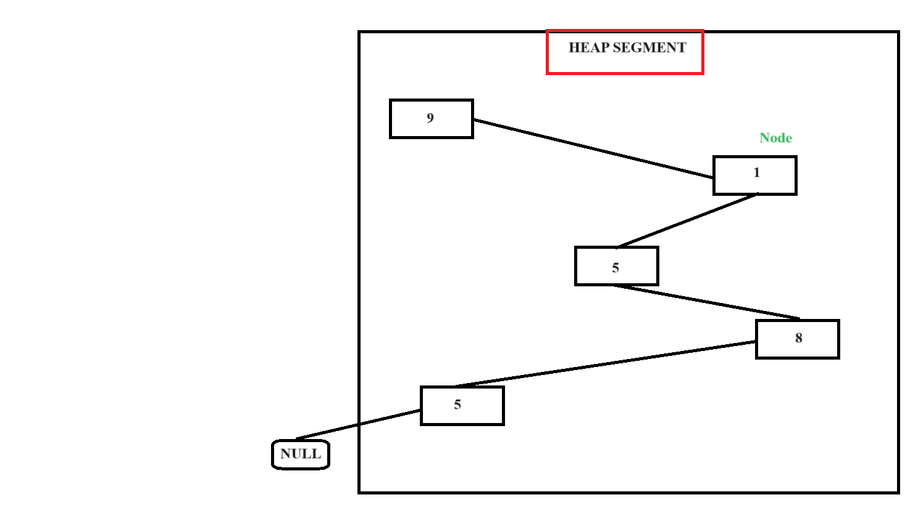
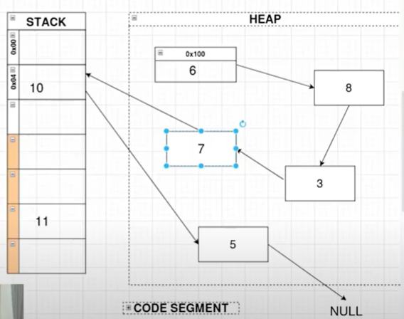

# Danh sách liên kết 

- Nó là 1 cấu trúc dữ liệu(một kiểu dữ liệu chứa nhiều kiểu dữ liệu khác bên trong)
- Danh sách liên kết là cấu trúc dữ liệu để lưu các giá trị có cùng kiểu dữ liệu với nhau
- Gần giống với `array` nhưng khác ở chỗ  địa chị của các ô nhớ (`node`) không liền kề nhau

Hình ảnh minh họa

Hình ảnh mình họa, ví dụ các vùng nhớ được liên kết với nhau có thể nằm ở cả `HEAP` và `STACK`

 

 8'24
