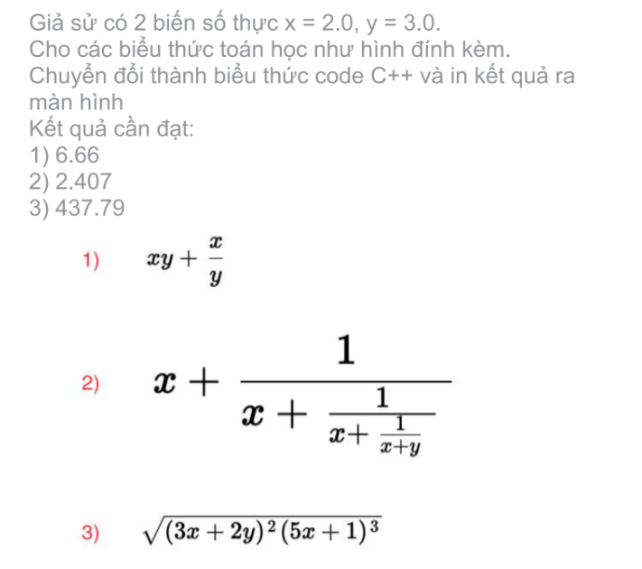
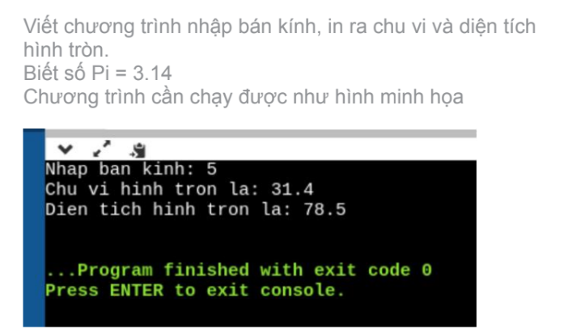
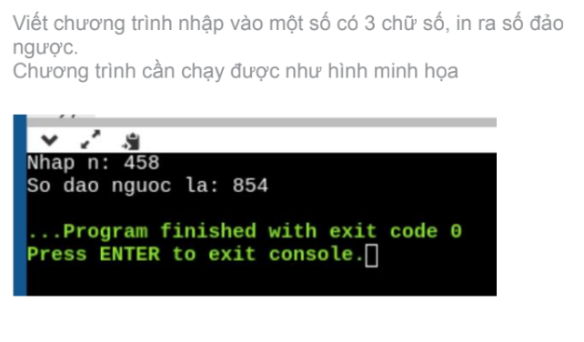
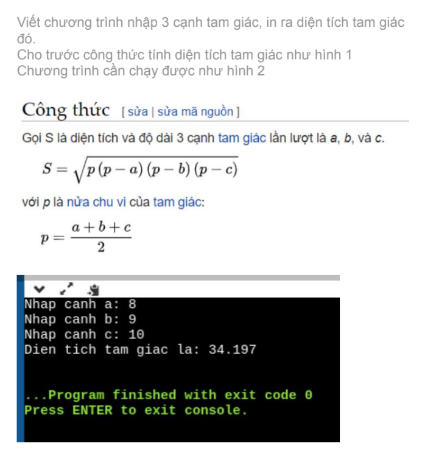
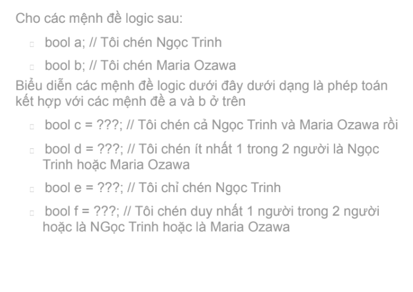
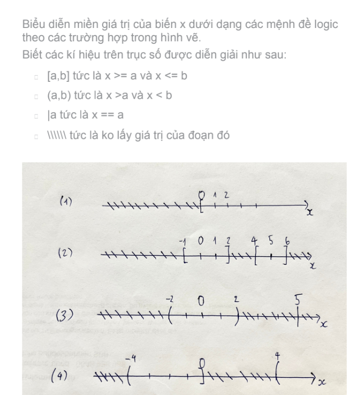
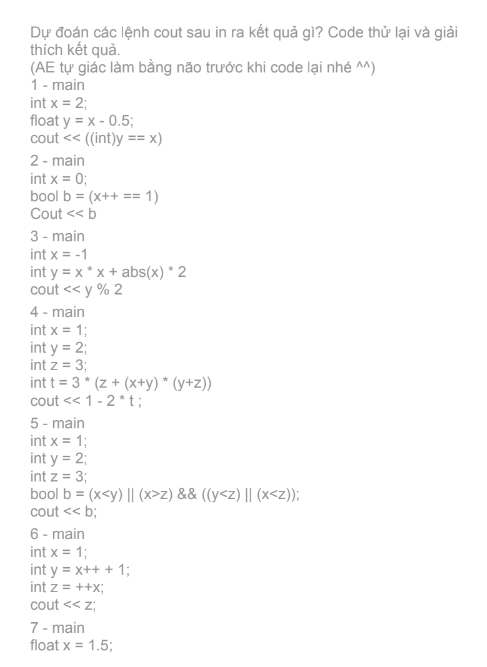
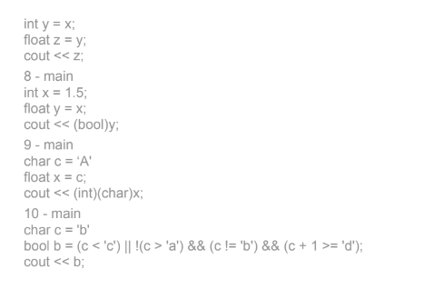

## ▶ 3. Các phép toán với biến

<details>
  <summary>
    <h3>3.1 Khái niệm toán tử và biểu thức - Operator and expression</h3>
  </summary>

  <h4>Nội dung chính:</h4>  

  - Ta có Variable là sự biến đổi giá trị của các biến.
  - Nó thông qua các phép toán(+,-,*,/,...): được gọi là Operator(toán tử).
  - Nếu các Operator đứng đơn lẻ thì không có ý nghĩa gì cả.
  - Chúng cần có các Variable hoặc các con số đứng cùng, được gọi là Operand(toán hạng).
  - Lúc này chúng đứng cùng nhau(Operator, Operand) ta có được Expression(biểu thức).

  ```c++
  #include <iostream>
  int main()
  {
    int a = 1; // Biến a được gán giá trị 1 qua toán tử "="
    int b = 2; // Tương tự cho biến b
    cout << a * b + 15; // a*b+15 = 17 | giá trị này được đưa vào luồng cout để đưa ra màn hình (cout trong thư viện iostream)
    return 0;
  }
  ```
  Phép toán có thể biểu diễn bằng kí hiệu (+,-,*,/,...) hiệu hoặc "chuỗi kí tự" hiểu đơn giản là hàm

  ```c++
  cout << sizeof(int_variable) // 4 byet 
  ```
  Số toàn hạng tham gia vào phép toán đó:
  - Có thể có 1 hoặc 2 toán hạng (operand) được dùng khi dùng 1 toán tử(operator).
  
  Độ ưu tiên - Precedent:
  - Sẽ có thứ tự thực hiện giữa các toán tử.

  Thứ tự thực hiện - Associativity:
  - Từ trái sang phải hay từ phải sang trái
  - Ví dụ với phép "+" sẽ làm việc với toán hạng bên tay phải trước

  ```C++
  // 3*4 sẽ được thực hiện trước, sau đó 1*2  rồi 2 + 12 
  cout << 1*2 + 3*4;
  
  ```
</details>


<details>
  <summary>
    <h3>3.2 Phép gán - assignment operator</h3>
  </summary>
  <h4>Nội dung chính:</h4>
  Phép gán - assignment operator.
  Biểu diễn: "=".

  Đặc điểm
  - Gán 1 giá trị nào đó cho 1 biến.
  - Số toán hạng tham gia vào phép gán là: 2.
  - Thứ tự ưu tiên của phép gán sau các phép toán(+,-,*,/,...).
  - Gáng giá trị bên phải sang biến bên trái.

  ```c++
  #include <iostream>
  int main()
  {
    int x; // Khai báo
    x = 10; // Khởi tạo giá trị - gán giá trị 10 cho x
    int y = 2; // Khaoi báo và khởi tạo 
    return 0;
  }
  ```

  Biến constant: chỉ được gán 1 lần duy nhất 
  Cú pháp:

  ```C++
  const int z = 100;
  ```

  ```C++
  int a = 1;
  int b = 2;
  // lưu ý : (a = b = 5) là một biểu thức expression - nên tương tự như biểu thức bình thường, ko phải hàm gì cả
  cout << (a = b = 5) << '\n'; 
  cout << x << '\n' << y << '\n';
  /*Kết quả là:
  5
  5
  5
  */
  ```

</details>


<details>
  <summary>
    <h3>3.3 Phép toán số học - Arithmetic operator</h3>
  </summary>

  <h4>Nội dung chính:</h4>
  
  - Các phép toán cơ bản trong toán học(+, -, *, /, %, ++, --) đều có trong lập trình.
   
  ```C++
  #include <iostream>
  int main()
  {
    // Phép cộng dùng toán tử "+"
    int x = 5 + 6;
    // Phép trừ dùng toán tử "-"
    int y = x - 1; 
    // Phép chia lấy phần nguyên dùng toán tử "/"
    int z = x * 2; 
    
    /* 
    * Trong lập trình thì phép chia là phép toán có nhiều hướng thực 
    * hiện, Nên cần chú ý khi thực hiện phép chia.
    */
    // Phép chia lấy phần nguyên dừng toán tử "/" 
    int i = 15 / 2; 
    //  Phép chia lấy phần dư dừng toán tử "%"
    int i = 15 % 2; // KQ: 1 

    /*
    * Vậy là sao để chia để nhận được kế quả số thực:
    * - Viết biểu thức dưới dạng số thự (VD: 10.0, 3.3,..)
    * - Biến nhận là kiểu số thực
    */
    float j = 15.0 / 2; 
    // Lưu ý biến số thực KHÔNG CÓ chia lấy phần dư
    // Không được chia cho số 0

    // Phép toàn tự tăng và tự giảm /
    // Kí hiệu: "a++" | "++a" | "a--"| "--a"| 
    // Kí hiệu: "a += b" | "a -= b" | "a *= b" | "a /=b" 
    int a = 0;
    a++; // Sau khi câu lệnh kết thúc bằng dấu ";" thì biến a mới tăng 1 đơn vị. 
    ++a; // Tăng ngay khi câu lệnh được thực hiện.
    
    /*
    * Phép toàn ưu tiên
    * Cú pháp: "( a + b ) * c"
    */
    int q = (1+2)*3;

    return 0;
  }
  ```
  <h4>Thư viện toán học</h4>

  Thư viện toán học - math library. Có các hàm cơ bản sau:
  Đây là phép toán được biểu diễn bằng chuỗi kí tự đã được nhắc ở các bài trước. Hay có thể gọi là hàm.

  - Hàm căn bặc 2 - sqrt(a) stand for "square root" 
  - Hàm mũ 2 - pow(a,b) stand for "power"
  - Hàm trị tuyệt đối - abs(a) - stand for "absolute"
  ```C++
  #include <iostream>
  #include <math.h> // Tại sao có chữ ".h"? Vì đây là thư viện của lập trình C 
  #include <cmath> // hoặc có thể viết NTN

  using namespace std;
  int main()
  {
    int x = 9;
    // In ra căn bậc 2
    cout << sqrt(x);
    // Đây là in ra x^4 . Dùng cho mũ lớn để giảm số lượng code.
    cout << pow(x,4);
    //In ra trị tuyệt đối  
    cout << abs(x);
    return 0;
  }
  
  ```
  <h4>Phép toàn cộng kí tự</h4>
  
  ```C++
  char x = 'A'; // Lưu trong bộ nhớ MT là một số nguyên nằm trong mã Asci
  cout << x; // KQ: 65
  cout << (x+1); // KQ: 66
  ```      
</details>


<details>
  <summary>
    <h3>3.4 Phép toàn quan hệ - Relation operator</h3>
  </summary>
  <h4>Nội dung chính:</h4>

  - Phép toàn quan hệ hay phép toán so sánh - Relation operator.
  
  - Các kiểu so sánh có thể có trong lập trình C++ cũng như trong toán học
  
    VD: > , <, ==, >=, <=, != 
  
  - Gía trị trả về của 1 biểu thức so sánh là bool đúng hoặc sai (nếu sai trả về "0" . nếu đúng trả vê "1")
  - 
  
  ```C++
  #include <iostream>
  using namespace std;
  int main()
  {
    int x = 1;
    // Đây là phép toán so sánh, dùng toán tử ">", biểu thức này trả về giá trị bool(đúng hoặc sai)
    x > 1;
    // sai -> trả về giá trị "0"
    cout << (x>1);
    // Đúng -> trả về giá trị "1"
    cout << (x>-1); 

    return 0;
  }
  ```
</details>


<details>
  <summary>
    <h3>3.5 Phép toàn logic - Logical operator</h3>
  </summary>
  <h4>Nội dung chính: </h4>
  
  - Phép toàn logic là chỉ có dúng hoặc sai. Tức là kiểu bool 
  - Các biến logic có thể +-*/ như các biến số nguyên vì nó là 0 và 1
  - Nhưng trong thực tế không ai làm như thể, có các phép toàn riêng cho toàn logic AND, OR, NOT(&&, ||, !,)
  - thứ tự ưu tiên: 0-"!", 1-"&&", 2-"||"

  ```C++
  #include <iostream>
  using namespace std;
  int main()
  {
    bool a = true; // 1
    bool b = true; // 1
    // phép toàn và  là phép NHÂN. Kí hiệu &&
    bool c = a&&b; // 1 
    // phép toàn và  là phép CỘNG. Kí hiệu ||
    bool d = a||b; // 0||0 = 0
    // phép phủ định
    bool e = !a // =0
    // các biến logic có thể +-*/ 
    cout << a+b; 
    

    return 0;
  }
  ```    
</details>


<details>
  <summary>
    <h3>3.6 Ép kiểu - Type casting operator</h3>
  </summary>
  <h4>Nội dung chính: </h4>

  - Ép kiểu là chuyển đổi kiểu dữ liệu
  
  - Với các kiểu dữ liệu nguyên thủy (bool, char, int, float, double,...)thường không cần ép kiểu tường mình (thủ công), mà sẽ được ép kiểu tự động

  - Các kiểu dự liệu mở rộng như : array, string, struct, typedef,.. KO thể ép kiểu tự động 

Cú pháp: 
```C++
    (int)ten_bien;
    (float)ten_bien;
    ...
```    
  VD:
  
  ```c++
  #include <iostream>
  #include <string>
  using namespace std;
  int main()
  {

    // CÁC KIỂU DỮ LIỆU NGUYÊN THỦY 
    // float -> int
    float x = 1.5;
    cout << (int)x;

    int y = 1;
    cout << (float)y;

    int z = 65;
    cout << (char)z; // in ra A

    // char -> int
    char j = 'A';
    cout << (int)j; // in ra 65
    
    // Ví dụ ép kiểu tự động 
    float so_thuc = 1.5;
    int bien_so_nguyen = so_thuc; // Vì gáng 1 số thực vào biến số nguyên
    cout << bien_so_nguyen; // KQ = 1 đã tự động ép kiểu

    // Ép kiểu cho kiểu dự liệu mở rộng 
    string s = "123.456"; // chuỗi kí tự 123 ko phải số 123
    // SAI - không phải kiểu dữ liệu nào cũng ép kiểu được
    int q = (int)s; // SAI
    // Nếu muốn ép kiểu cho câu lệnh trên thì cần tạo 1 hàm riêng để ép
    
    int q = stoi(s); // string to interger lấy tất cả các số đầu tiên đến khi gặp dấu . hoặc chữ này đó
    int k = stof(s);


    // Ep số thành chuỗi
    int kk = 199;
    string s = to_string(kk); // s = "199"

    return 0;
  }
  ``` 
</details>

Hình minh họa BT 1:

BT 2

BT 3

BT 4

BT 5

BT 6

BT 7

