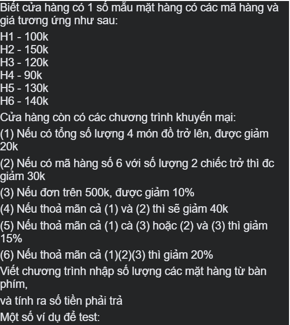
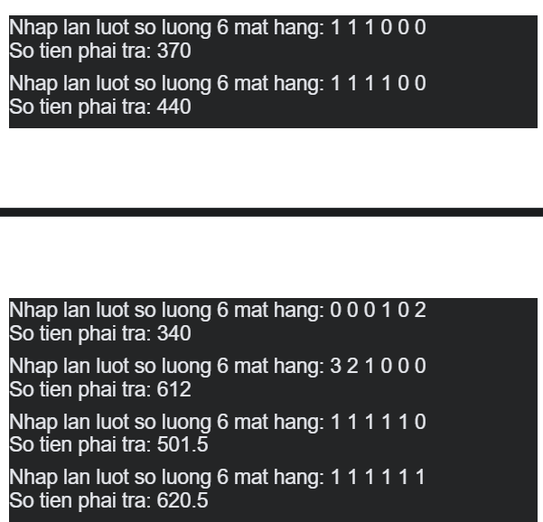

## ▶ Chương 4 Cấu trúc rẻ nhanh - If else :dollar:
<details>
  <summary>
    <h3>4.1 Cấu trúc rẽ nhánh If else - Conditional statements</h3>
  </summary>
    
    Xuất hiện trong mọi lại ngôn ngữ lập trình
    Có 2 loại rẻ nhánh là: IF ELSE và SWITCH CASE

  <h4>Nội dung chính:</h4> 

  - Thế nào là cấu trúc rẻ nhánh (hay cấu trúc điều khiển, hay câu điều kiện, hay if else)? Hiểu đơn giản là nếu thỏa mãn điều kiện thì sẽ làm điều gì đó.
  - Có thể dùng if else lồng nhau để xử lí chi tiết vấn đề.
  - Trong câu điều kiện If else nếu 1 đk đúng thì sẽ ko làm việc với các điều kiện còn lại, đây cũng là 1 điều cần lưu ý để tránh việc sót các điều kiện khi tạo ra 1 câu điều kiện. 
  - Có nhưng trường hợp không bặt buộc phải có else hoặc if else.
  - Chú ý: Có nhiều kiểu câu điều kiện có thể xảy ra nhưng đây là 4 kiểu chính. Cần phải lưu ý.

  ```C++
  // 1. Đây là câu lệnh: if
  if(dieu_kien)
  {
    // Các câu lệnh
  }

  // 2. Đây là câu lệnh if else
  if(dieu_kien)
  {
    // Các câu lệnh
  } 
  else
  {
    // Câu lệnh
  }

  // 3. Đây là câu: if() else if() else()
  if (dk_1)
  {
    //...
  } 
  else if(dk_2)
  {
    //...
  }
  else // CÁC ĐK CÒN LẠI
  {
    //...
  }

  //4. Đây là if eles lồng nhau

  if(dk_1)
  {
    if(dk_2)
    {
        //...
    }
    else
    {
        //...
    }
  }
  else 
  {
    //...
  }   

  ``` 

  <h4>Chương trình ví dụ:</h4>

  ```C++
  #include <iostream>
  using namespace std; 
  int main()
  {

    // VD cho câu điều kiện if else đơn giản
    bool catched = 1;
    if(catched)
    {
        cout << "CM dính bẫy rồi!"
    } else
    {
        cout << "May quá!"    
    }

    // VD if else lồng nhau
    int tuoi = 19;
    if(tuoi >= 18)
    {
        cout >> "\nDu tuoi di tu.";
    } 
    else if(tuoi >= 15 && tuoi<18)
    {
        cout << "Chua du tuoi di tu, co the dua vao trai giao duong."
    } 
    else 
    {
        cout << "Chua du tuoi di tu. Nhac nho, canh cao!";
    }
  }
  ```
  </details>


  <details>
    <summary>
        <h3>4.2 Toán tử điều kiện - Conditional Operator  </h3>
    </summary>
        
  <h4>Nội dung chính:</h4> 
  - Điểm khác biệt so với câu điều kiện if else là: KHÔNG cần khối lệnh 
  - Chỉ cần 1 câu lệnh cho phép rẻ nhánh
  - Nó là 1 biểu thức trả về giá trị cụ thể (cần lưu ý), vì thế có thể đưa nó vào luồng output ```cout``` để in ra màn hình.
  - Độ ưu tiên, nếu không rõ chỉ cần chú ý thì cứ đưa vào cặp ngoặc tròn
  - Vậy khi nào nên dùng loại toán tử này: đối với các điều kiện đơn giản.

  Cú pháp:
  ```C++
  // nếu điều kiện đúng thực hiện return_value_A nếu không thực hiện return_value_B
  dieu_kien? <return_value_A> : <return_value_B>
  ```

  <h4>Chương trình ví du:</h4>
  ```C++
  #include <iostream>
  using namespace std;
  int main()
  {
    int tuoi = 16;
    //Đưa vào luồng output được vì đây là dữ liệu trả về.
    cout << ((tuoi >= 18)? "Da du tuoi di tu" : "Chua du tuoi di tu");
    return 0;
  }
  ```

  </details>


  <details>
    <summary>
        <h3>4.3 Cấu trúc lựa chọn switch case - Switch case statement</h3>
   </summary>
        
  <h4>Nội dung chính:</h4> 
  
  - Các hoạt động khác if else một chút.
  - Switch case là một trường hợp của if else, được tạo ra để viết gắn gọn chương trình.
  - Chuyên dụng để kiểm tra các biến số nguyên hoặc kí tự (tránh các biến constant hoặc các biến đặt biệt).
  - Với cấu trúc này cũng khá tính linh hoạt có thể kế hợp với cấu trúc điều kiện khác và các câu lệnh ```break, contiune, goto,..``` để tạo ra các chương trình nâng cao hơn (rất hay). 

    Cú pháp:
    ```C++
    switch(tham_so_sanh_bang) // đưa 1 tham số so sánh bằng vào đay
    {
        case x1: // với x là 1 kí tự so sánh với tham số trên 
        {
            // Các câu lệnh cần thực hiện
            break; //bắt buộc phải có
        }
        case x2:
        {
            break;
        }
    }

    ```


<h4>Chương trình mẫu:</h4>

  ```C++
  #include <iostream>
  #include <string>

  using namespace std;
  int main()
  {
    // Ví dụ với IF ELSE
    int month = 0
    string s = "";

    if (month == 1)
    {
        s = "January";
    }
    else if (month == 2)
    {
        s = "Febuary";
    }
    else if (month == 3)
    {
        s = "MarCH";
    } // TƯỞNG TỰ CHO CÁC THÁNG SAU
    cout << s;

    // VD switch case
    switch(month)
    {
        case 1:
            s = "January";
            break;
        case 2:
            s = "Febuary";
            break;
        case 3:
            s = "March"
            break;
    }
    cout << s;
    return 0;
  }

  ``` 

  </details>

  <details>
    <summary>
      <h4>Đề bài</4>
    </sumary>
    
    bài 7:

    
    

  </details>