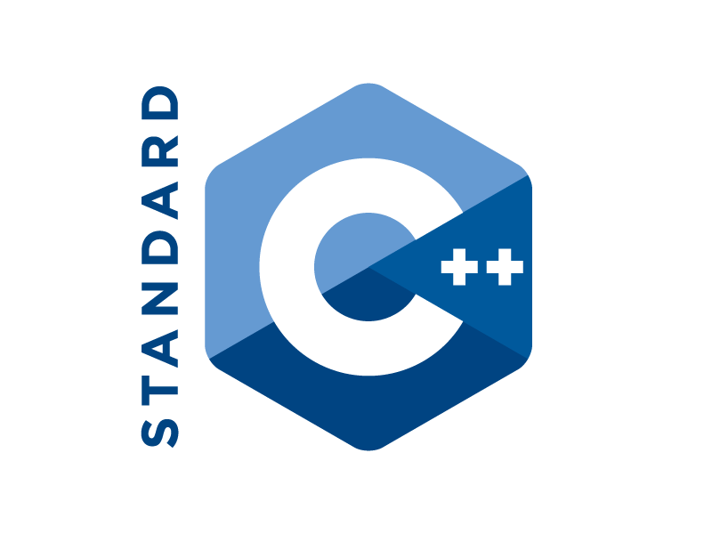

# Nền tảng lập trình - Ngôn ngữ C++

<summary>
  <h1>▶ 2. Biến và kiểu dữ liệu - Variable and Datatype </h2>
</summary>

<details>
  <summary>
    <h2>2.1 Khái niệm biến và kiểu dữ liệu - Variable and Data type Explained </h2>
  </summary>
  <h3>Biến là:</h3>
  - Đối tượng chiếm một vùng nhớ xác định
  - Dùng để lưu trữ giá trị nào đó
  <h3>Variable Explained:</h3>
  - abc
  <h3>Kiểu dữ liệu là:</h3>
  - Tập hợp của các loại giá trị mà có thể khởi tạo cho một biến 
  <h3>Data type exlained:</h3>
  - abc
</details>

<summary>
  <h1>▶ 3. Toán tử, toán hạng, biểu thức</h1>
</summary>
<details>
  <summary>
    <h2>3.1 Khái niệm toán tử</h2>
  </summary>
  <h3>Nội dung chính:</h3>
  
  Ta có Variable là sự biến đổi giá trị của các biến.
  
  Nó thông qua các phép toán(+,-,*,/,...): được gọi là Operator(toán tử).
  
  Nếu các Operator đứng đơn lẻ thì không có ý nghĩa gì cả.
  
  Chúng cần có các Variable hoặc các con số đứng cùng, được gọi là Operand(toán hạng).
  
  Lúc này chúng đứng cùng nhau(Operator, Operand) ta có được Expression(biểu thức).
  ```c++
  #include <iostream>
  int main()
  {
    int a = 1; // Biến a được gán giá trị 1 qua toán tử "="
    int b = 2; // Tương tự cho biến b
    cout << a * b + 15; // a*b+15 = 17 | giá trị này được đưa vào luồng cout để đưa ra màn hình (cout trong thư viện iostream)
    return 0;
  }
  ```
  <h3>Phép toán có thể biểu diễn bằng kí hiệu (+,-,*,/,...) hiệu hoặc "chuỗi kí tự" hiểu đơn giản là hàm</h3>

  ```c++
  cout << sizeof(int_variable) // 4 byet 
  ```
  <h3>Số toàn hạng tham gia vào phép toán đó</3>
  - Có thể có 1 hoặc 2 toán hạng (operand) được dùng khi dùng 1 toán tử(operator)
  <h3>Độ ưu tiên - Precedent</h3>
  - Sẽ có thứ tự thực hiện giữa các toán tử 
  <h3>Thứ tự thực hiện - Associativity</h3>
  - Từ trái sang phải hay từ phải sang trái
  - Ví dụ với phép "+" sẽ làm việc với toán hạng bên tay phải trước

  ```C++
  // 3*4 sẽ được thực hiện trước, sau đó 1*2  rồi 2 + 12 
  cout << 1*2 + 3*4;
  
  ```
</details>

[comment]: <> (This is a comment, it will not be included)

<details>
  <summary>
    <h2>3.2 Phép gán - assignment operator</h2>
  </summary>
      
</details>
-------------------------------------------------------------------------
abc
-------------------------------------------------------------------------
